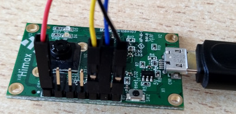

# What's that smell workshop

- [What's that smell workshop](#whats-that-smell-workshop)
  - [Preparation](#preparation)
  - [Hardware requirements](#hardware-requirements)
  - [How to connect Himax WE-I Plus to the Sparkfun breakout board](#how-to-connect-himax-we-i-plus-to-the-sparkfun-breakout-board)
  - [Software requirements](#software-requirements)
  - [Example applications](#example-applications)

This repo contains the example applications for the
[workshop](https://www.edgeimpulse.com/blog/ai-workshop-whats-that-smell) with
`SparkFun Environmental Combo Breakout - CCS811/BME280 (Qwiic)` and `Himax WE-I
Plus` devboard.

## Preparation

Before continue with the *What's that smell workshop* complete the image
classification tutorial using the Himax WE-I Plus board:
<https://docs.edgeimpulse.com/docs/image-classification>.

## Hardware requirements

- [Himax WE-I Plus](https://www.sparkfun.com/products/17256)
- [SparkFun Environmental Combo Breakout - CCS811/BME280 (Qwiic)](https://www.sparkfun.com/products/14348)

_**Note from
[datasheet](https://cdn.sparkfun.com/assets/2/c/c/6/5/CN04-2019_attachment_CCS811_Datasheet_v1-06.pdf)**:
CCS811 performance in terms of resistance levels and sensitivities will change
during early life. The change in resistance is greatest over the first 48 hours
of operation. CCS811 controls the burn-in period allowing eCO2 and eTVOC
readings to be used from first power-on after 60 minutes of operation._

## How to connect Himax WE-I Plus to the Sparkfun breakout board

You can load the [read-sensor](read-sensor/README.md) firmware to start the
burn-in period.

## Software requirements

- [Docker](https://docs.docker.com/get-docker/)
- [Edge Impulse CLI](https://docs.edgeimpulse.com/docs/cli-installation)

## Example applications

- [read-sensor](read-sensor/README.md): capture CO2, TVOC and Humidity values
  and forward values on serial port.
- [classification](classification/README.md): run inference on target.

After a long IDLE period, you should wait for 20 minutes before accurate
readings are generated (see
[datasheet](https://cdn.sparkfun.com/assets/2/c/c/6/5/CN04-2019_attachment_CCS811_Datasheet_v1-06.pdf)).

A public project to classify tea and chocolate is available
[here](https://studio.edgeimpulse.com/public/23260/latest/). This should just
be used as a reference as samples are tighly correlated to the air quality and
products.
